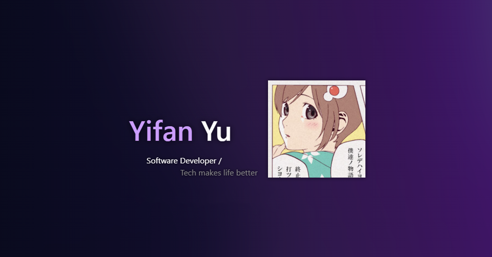
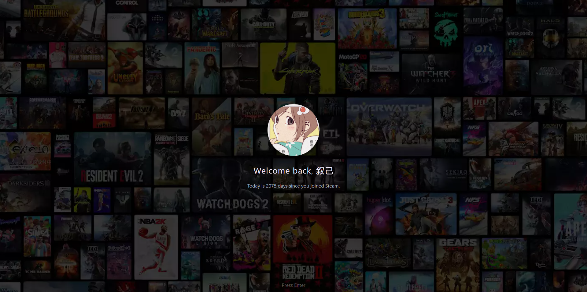
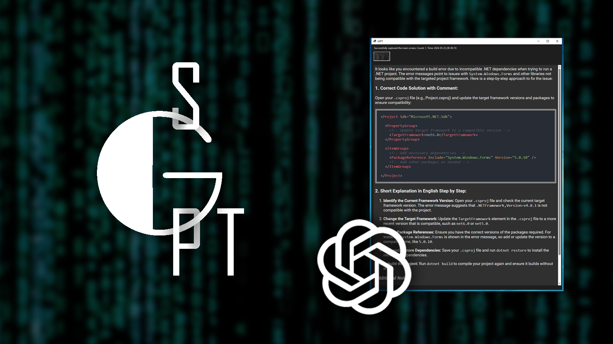
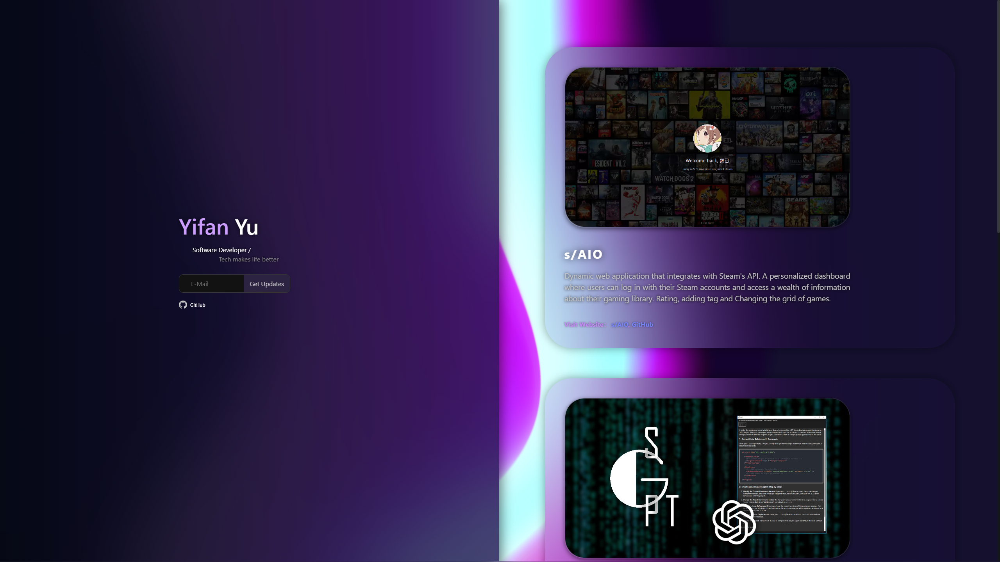
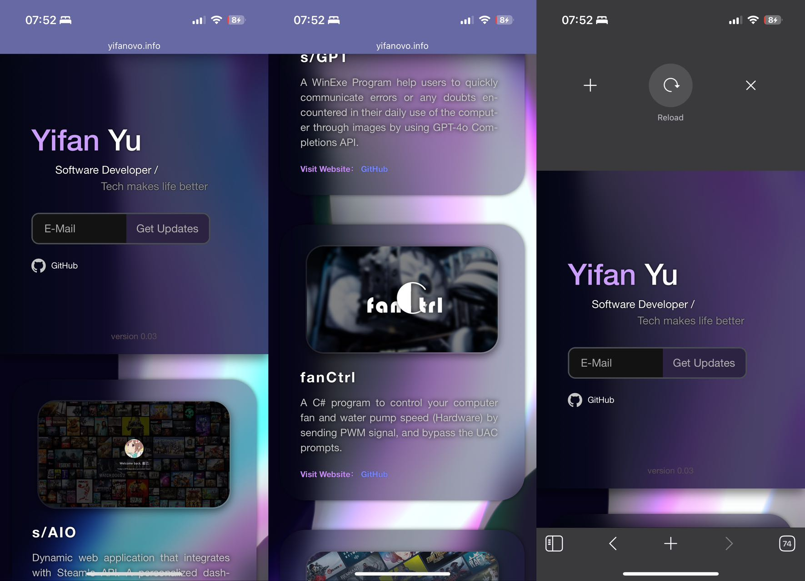
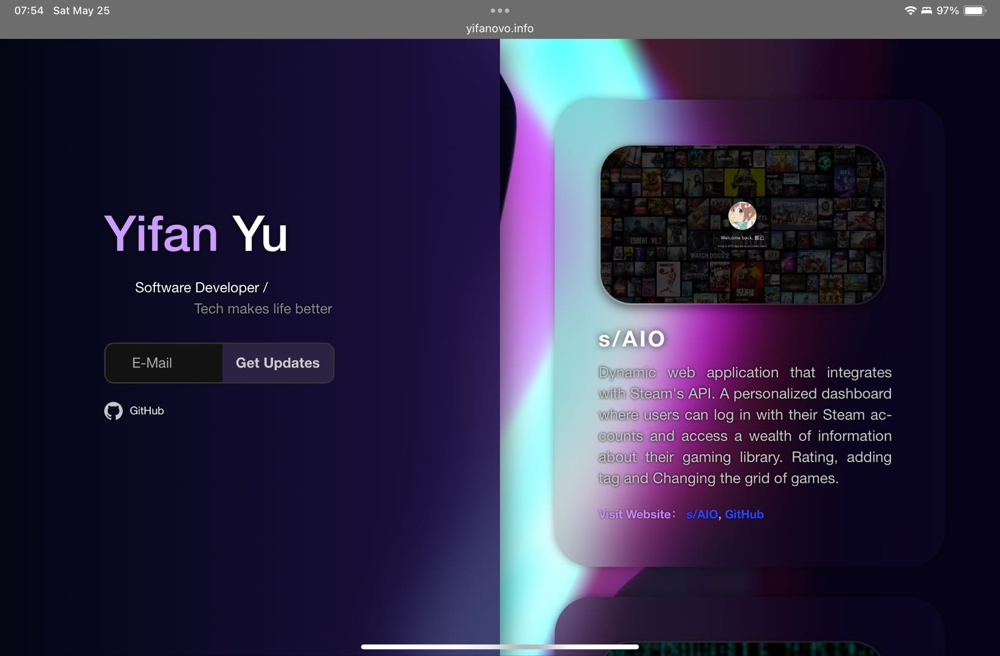
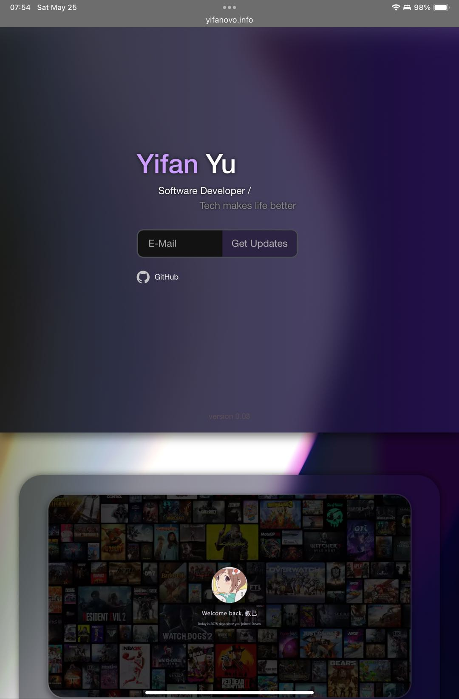

# yifanovoWeb
 
**A Website Front-End/** 
**Showcase projects** I have personally completed in the past.  
Host on *AWS Elastic Beanstalk-t3*.  

Link: **[yifanovo.info](http://yifanovo.info "Personal project website by Yifan")**

## Development Plan
#### *Version - 1.0.7.2.24*
- Mail subscription system √  
- Web message notification and dynamic effects of components √  
- Front-end and back-end deployment √
- Dynamic effects for subscription components √
- Optimized visuals for mobile √
### Next Steps

### 1. Dynamic Timeline Display
- **Objective**: Display a dynamic timeline on the personal homepage, showing the creation time of each project.
- **Tasks**:
  1. Fetch the creation time for each project from the database.
  2. Design and implement a timeline component that dynamically updates with the project creation times.
  3. Integrate the timeline component into the personal homepage.

### 2. Track Webpage Visits
- **Objective**: Record and display the history of webpage visits, including IP addresses, to dynamically show the number of visits.
- **Tasks**:
  1. Implement backend logic to capture and store visit data, including IP addresses, in the database.
  2. Create a front-end component to display the visit count dynamically.
  3. Integrate the visit tracking logic with the personal homepage and ensure real-time updates.

### 3. Allow Anonymous Likes
- **Objective**: Enable users to like the webpage without logging in, and record the like data including device ID and like count.
- **Tasks**:
  1. Implement backend logic to capture and store like data, including device ID and like count, in the database.
  2. Create a front-end component to allow users to like the webpage anonymously.
  3. Ensure that the like button dynamically updates with the total like count and prevents multiple likes from the same device within a short period.

## Projects:
### [s/AIO](http://saio.us-east-2.elasticbeanstalk.com)
> Dynamic web application that integrates with Steam's API. A personalized dashboard where users can log in with their Steam accounts and access a wealth of information about their gaming library. Rating, adding tag and Changing the grid of games.

   

Link: [GitHub](https://github.com/yifanwow/saio)
____
### s/GPT
> A Windows executable program that enables users to swiftly address errors or queries they encounter during daily computer use by utilizing images and the GPT-4 Completions API.

   

Link: [GitHub](https://github.com/yifanwow/sGPT)  
____
### fanCtrl
> A C# application for managing computer fan and water pump speeds by sending PWM signals, effectively circumventing UAC prompts.

   

Link: [GitHub](https://github.com/yifanwow/fanCtrl)
____
### Grid View Engine
> A custom-built software allowing users to modify the grid layout of their Steam library.

   

Link: [GitHub](https://github.com/yifanwow/Grid_view_Engine)

## Snapshotting:
### Desktop :

### Mobile Device :

### Pad:
  

   

### Step:1 Create a react project:

    npx create-react-app {projectname}  
    cd  
    npm start  

### Step2: Install the plugins I used:

    npm install bulma  
    npm install react-router-dom 
    npm install lodash 
    npm install lodash.debounce  
    //In Order to using Customizing webpack configuration
    npm install copy-webpack-plugin --save-dev    
    npm install react-app-rewired --save-dev  
    npm install react-app-rewired copy-webpack-plugin --save-dev

### Step:3 For Back-end:

    mkdir server
    cd server
    mkdir routes, controllers
    touch app.js
    npm init -y
    npm install express body-parser cors nodemailer
    